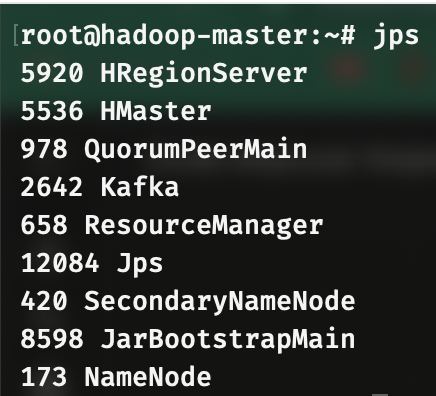
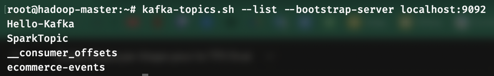
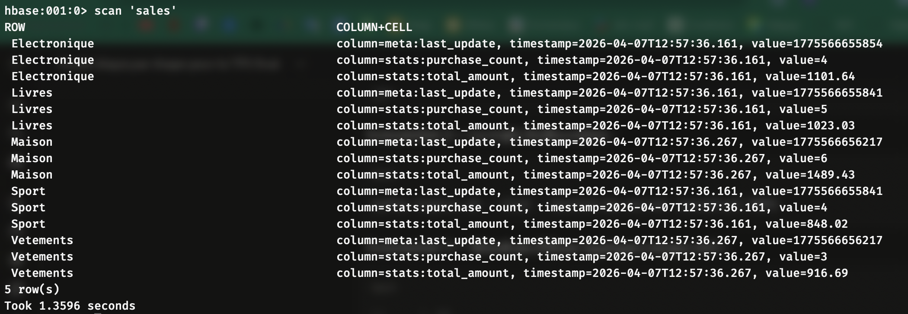
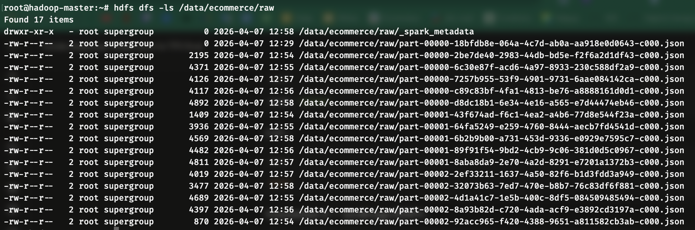
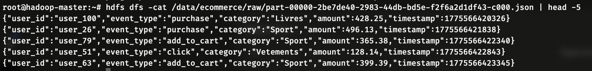
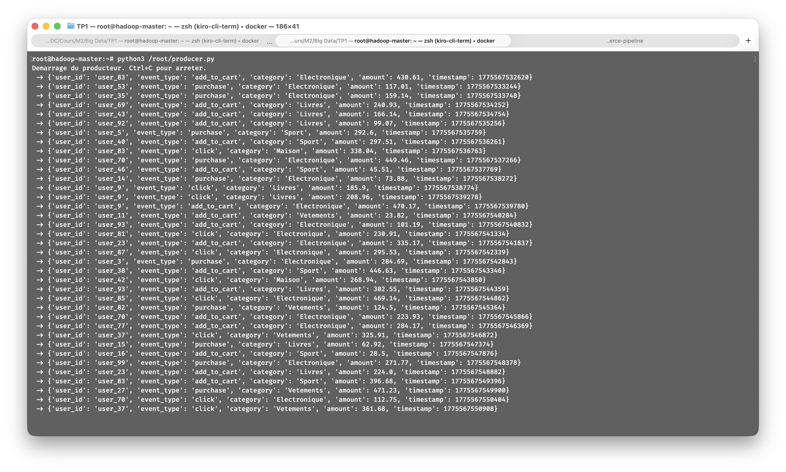

# TP5 - Pipeline Big Data End-to-End

## Architecture implémentée

```
[ Producteur Python ]
        |
        v
[ Kafka : topic 'ecommerce-events' (3 partitions) ]
        |                       |
        v                       v
[ Spark Structured        [ HDFS : archive
  Streaming ]               événements bruts ]
        |                   /data/ecommerce/raw/
        v
[ HBase : table 'sales' ]
  (agrégats par catégorie)
```

Cette architecture correspond à la Lambda Architecture :

- **Speed Layer** : Kafka → Spark Streaming → HBase (agrégats temps réel)
- **Batch Layer** : Kafka → Spark → HDFS (archivage JSON pour analyses futures)

---

## Captures d'écran

### 1. Processus actifs (jps)



### 2. Topics Kafka



### 3. Table HBase - Résultats des agrégats



### 4. Archivage HDFS - Liste des fichiers



### 5. Contenu d'un fichier JSON archivé



### 6. Producteur Python en fonctionnement



## Partie 4 - Réponses aux questions

### 4.1 Présentation du pipeline

**Problèmes rencontrés et solutions :**

- **HBase RegionServer ne démarrait pas automatiquement** : Le script `start-hbase.sh` ne lançait pas le RegionServer sur le nœud master. Solution : lancement manuel avec `hbase regionserver start &`.
- **HBase Master en état "initializing"** : Le Master attendait qu'un RegionServer se connecte. Une fois le RegionServer lancé manuellement, le Master a pu terminer son initialisation.
- **Spark trop lent avec 200 partitions** : Par défaut, Spark utilise 200 shuffle partitions, ce qui est excessif pour notre petit cluster Docker. Solution : ajout de `--conf spark.sql.shuffle.partitions=3` au `spark-submit`.
- **Conflit de classe `Row`** : Les imports wildcard créaient une ambiguïté entre `org.apache.spark.sql.Row` et `org.apache.hadoop.hbase.client.Row`. Solution : utilisation d'imports explicites.

**Composant le plus long à mettre en place :**

L'intégration Spark → HBase a nécessité le plus de temps. La configuration des dépendances Maven, la copie des librairies HBase dans le classpath Spark (`cp -r $HBASE_HOME/lib/* $SPARK_HOME/jars`), et le débogage de l'écriture via `foreachBatch` ont été les étapes les plus complexes.

**Que se passe-t-il si le broker Kafka tombe ?**

Spark Streaming ne pourra plus lire de nouveaux messages. Cependant, grâce au système de checkpoints et aux offsets Kafka, Spark reprendra automatiquement là où il s'était arrêté une fois le broker relancé. Aucune donnée n'est perdue car Kafka persiste les messages sur disque.

**Que se passe-t-il si un worker Spark tombe ?**

Dans notre configuration `local[4]`, tout tourne sur le même nœud donc ce serait un arrêt complet. En mode cluster YARN, si un executor tombe, le Spark Driver demande à YARN de relancer un nouvel executor. Les tâches en cours sur l'executor perdu sont réassignées. Le checkpoint assure la reprise sans perte.

---

### 4.2 Questions Tech Lead

#### Q1 : Pipeline avec 1 million d'événements/seconde - quelles modifications ?

Avec un tel volume, plusieurs modifications seraient nécessaires :

- **Kafka** : Augmenter le nombre de partitions (ex. 50-100) et déployer un cluster multi-brokers pour répartir la charge. Le partitionnement par catégorie permettrait un traitement parallèle efficace.
- **Spark** : Passer en mode cluster YARN avec plusieurs executors répartis sur les workers. Réduire l'intervalle de trigger (ex. 5 secondes) et utiliser le mode `append` plutôt que `update` pour limiter le retraitement.
- **HBase** : Utiliser des écritures en batch (BufferedMutator) plutôt que des Put individuels. Pré-splitter les régions de la table pour éviter les hotspots. Augmenter le nombre de RegionServers.
- **Architecture** : Ajouter un buffer intermédiaire et dimensionner le cluster (ex. 10-20 nœuds) pour absorber le débit.

#### Q2 : HBase vs Redis vs Cassandra vs PostgreSQL - critères de choix ?

| Critère              | HBase          | Redis                     | Cassandra  | PostgreSQL |
| -------------------- | -------------- | ------------------------- | ---------- | ---------- |
| Latence lecture      | ~ms            | ~µs                       | ~ms        | ~ms        |
| Scalabilité écriture | Très bonne     | Limitée (RAM)             | Excellente | Limitée    |
| Persistance          | HDFS (durable) | RAM (volatile par défaut) | Disque     | Disque     |
| Intégration Hadoop   | Native         | Aucune                    | Moyenne    | Faible     |
| Complexité           | Élevée         | Faible                    | Moyenne    | Faible     |

**Notre choix HBase se justifie par** : la colocalisation avec HDFS (les données brutes et les agrégats sont sur le même cluster), l'intégration native avec l'écosystème Hadoop, et la capacité à gérer de très grands volumes avec scalabilité horizontale.

**Redis** aurait été pertinent si on avait besoin de latences ultra-faibles (dashboards temps réel) mais pose un problème de capacité mémoire. **Cassandra** serait un bon choix pour des écritures massives distribuées multi-datacenter. **PostgreSQL** conviendrait pour des volumes modérés avec des requêtes SQL complexes.

#### Q3 : Justification de l'architecture au DSI

**Kafka** a été choisi comme bus de messages car il découple les producteurs des consommateurs, garantit la persistance des événements et supporte le rejeu. C'est le standard de l'industrie pour l'ingestion temps réel. Coût : open-source, complexité moyenne.

**Spark Structured Streaming** traite le flux en micro-batches avec une API SQL familière. Il offre la tolérance aux pannes via les checkpoints et s'intègre nativement avec Kafka et HDFS. Alternative moins coûteuse en compétences que Flink. Coût : open-source, nécessite des développeurs Spark.

**HBase** stocke les résultats agrégés pour une consultation rapide. Sa colocalisation avec HDFS évite les transferts réseau et réduit les coûts d'infrastructure. Coût : open-source, inclus dans le cluster Hadoop existant.

**HDFS** archive les événements bruts pour des analyses batch futures (machine learning, rapports mensuels). Le stockage est fiable grâce à la réplication et économique pour de grands volumes. Coût : déjà en place.

**Valeur métier** : cette architecture permet de voir le chiffre d'affaires par catégorie en temps réel (délai < 1 minute) tout en conservant l'historique complet pour des analyses approfondies. Le tout avec des technologies open-source, sans coût de licence.

---

## Commandes clés utilisées

```bash
# Démarrage de l'environnement
docker start hadoop-master hadoop-worker1 hadoop-worker2
docker exec -it hadoop-master bash
./start-hadoop.sh
./start-kafka-zookeeper.sh
start-hbase.sh
hbase regionserver start &

# Kafka - Création du topic
kafka-topics.sh --create --topic ecommerce-events \
  --replication-factor 1 --partitions 3 \
  --bootstrap-server localhost:9092

# Producteur Python
python3 /root/producer.py > /dev/null 2>&1 &

# HBase - Création table
hbase shell
create 'sales', 'stats', 'meta'

# HDFS - Répertoire d'archivage
hdfs dfs -mkdir -p /data/ecommerce/raw

# Spark Streaming
cp -r $HBASE_HOME/lib/* $SPARK_HOME/jars
spark-submit --class tn.insat.tp5.EcommercePipeline \
  --master local[4] \
  --conf spark.sql.shuffle.partitions=3 \
  /root/pipeline.jar > /root/pipeline.log 2>&1 &

# Vérifications
scan 'sales'                              # HBase
hdfs dfs -ls /data/ecommerce/raw          # HDFS
```
